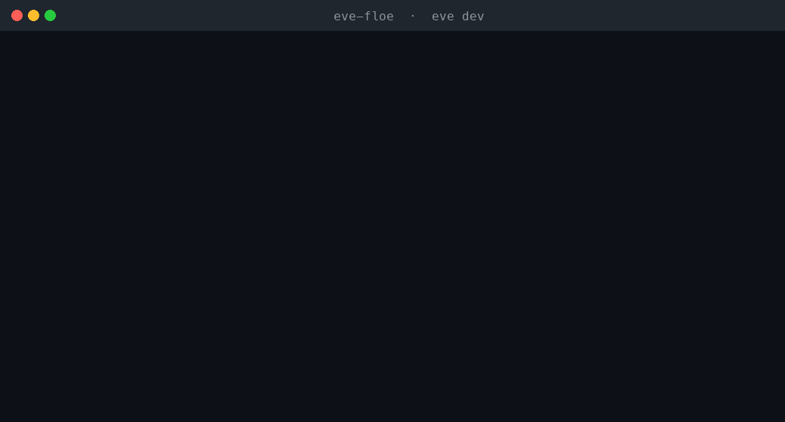

# eve-floe — spend controls for Vercel Eve agents

**Give your [Eve](https://eve.dev) agent a budget it can't blow past.** Eve agents
are autonomous, durable, and run unattended — Vercel's own launch cites a lead
agent that costs **$5,000/yr to run**. This template wires an Eve agent to
[Floe](https://floelabs.xyz) so every dollar it pays for an API is **hard-capped
server-side**, with the agent tapering as it nears the limit instead of getting
cut off.

> Floe governs the **vendor/API plane** (what your agent *pays* — 2,000+ x402
> APIs). Vercel **AI Gateway** governs the **model plane**. Together = complete
> agent spend control.



## What's in here

A runnable Eve agent with spend control built in:

- A **lead** research agent that delegates web fetching to a **`fetcher`** subagent.
- The `fetcher` pays real **x402 APIs** through Floe and has its **own** budget cap
  (its own Floe key) — independent of the lead. Both the per-agent cap and your
  developer-wide cap are enforced on every payment.
- Each agent holds **one** secret (a Floe key) — never a provider or vendor key.

```text
agent/
├── agent.ts                  # lead agent
├── instructions.md
├── connections/floe.ts       # lead's Floe budget (FLOE_AGENT_KEY)
└── subagents/fetcher/
    ├── agent.ts              # fetcher subagent
    ├── instructions.md
    └── connections/floe.ts   # fetcher's OWN capped budget (FLOE_FETCHER_KEY)
```

## Quickstart

**Prereq:** Node.js **24+** (required by `eve`).

```bash
git clone https://github.com/Floe-Labs/eve-floe.git
cd eve-floe
npm install
cp .env.example .env          # then fill in the two keys
```

Create two agent keys — each with its own budget cap — at the
[Floe dashboard](https://dev-dashboard.floelabs.xyz/?utm_source=eve&utm_medium=readme&utm_campaign=eve-floe),
set `FLOE_AGENT_KEY` and `FLOE_FETCHER_KEY` in `.env`, then:

```bash
npx eve dev
```

Ask it to research a topic. Watch the `fetcher` pay for sources until it nears its
cap, taper, and **stop at the budget** — the runaway can't happen.

## How the spend control works

- **Hard cap (the guarantee):** the `fetcher`'s key has a budget; over-budget x402
  payments are **refused server-side** before they settle. A refused call means the
  agent is done — not that it should retry.
- **Advisory (the upside):** the agent reads its Floe budget advisory and tapers
  (fewer/cheaper fetches) as it approaches the cap, so it finishes useful work on
  budget instead of being cut off mid-task.
- **Two tiers:** each (sub)agent's own cap **and** your developer-wide cap are both
  checked on every payment.

## Add Floe to your *own* Eve agent

You don't need this whole template — it's two steps to add Floe to any Eve agent.
See [`docs/ADD-FLOE-TO-YOUR-EVE-AGENT.md`](docs/ADD-FLOE-TO-YOUR-EVE-AGENT.md).

## Honest scope

This caps what your agent **pays vendors/APIs** (the x402/tool plane). Your
**model** spend is governed by Vercel **AI Gateway**, not Floe — the two are
complementary. We don't claim to cap model tokens.

## License

MIT — see [LICENSE](LICENSE).
